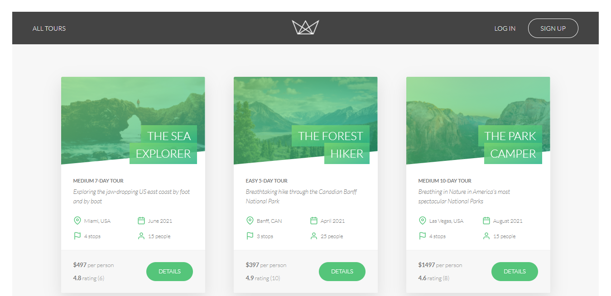

# Natours

This is the clone of `http://natours.dev` which is implemented on Reactjs.

This frontend project needs a backend to serve Tours and to authenticate users.

If you wish to run this project locally.

`npm install`

`npm start`

Visit `http://localhost:3000`

## Screenshot

---

### Thanks
